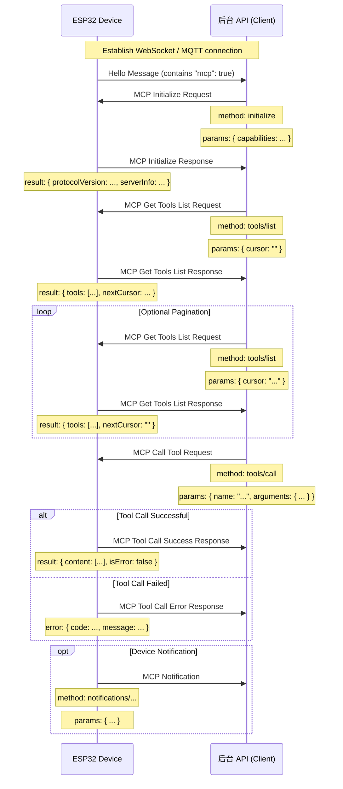

# MCP (Model Context Protocol) Interaction Flow  - mcp-protocol.md

**NOTE:** AI‑assisted generation. When implementing the backend service, **please verify details against the code**.

In this project the MCP protocol is used for communication between the **backend API (MCP client)** and the **ESP32 device (MCP server)**, enabling the backend to discover and invoke the **functions (tools)** provided by the device.

## Protocol Format  

According to the code (`main/protocols/protocol.cc`, `main/mcp_server.cc`), an MCP message is encapsulated inside a **base communication protocol** (e.g., WebSocket or MQTT) payload. Its internal structure follows the **JSON‑RPC 2.0** specification:  

```json
{
  "session_id": "...", // session ID
  "type": "mcp",       // message type, fixed to "mcp"
  "payload": {         // JSON‑RPC 2.0 payload
    "jsonrpc": "2.0",
    "method": "...",   // method name (e.g., "initialize", "tools/list", "tools/call")
    "params": { ... }, // method parameters (for requests)
    "id": ...,         // request identifier (for requests and responses)
    "result": { ... }, // method execution result (for success responses)
    "error": { ... }   // error information (for error responses)
  }
}
```

The `payload` section is a standard JSON‑RPC 2.0 message:

- `jsonrpc`: the fixed string `"2.0"`.  
- `method`: the name of the method to invoke (for **request**).  
- `params`: the method’s parameters, a structured value usually an object (for **request**).  
- `id`: an identifier for the request, supplied by the client and echoed back by the server. It is used to match requests and responses.  
- `result`: the outcome of a successful method execution (for **success responses**).  
- `error`: error information when a method fails (for **error responses**).

## Interaction Flow and When Messages Are Sent  

MCP interaction mainly revolves around the client (backend API) discovering and calling **tools** on the device.

### 1. Connection Establishment & Capability Announcement  

- **When:** After the device boots and successfully connects to the backend API.  
- **Who sends:** The **device**.  
- **Message:** The device sends a “hello” message of the underlying protocol to the backend API, including the device’s supported capabilities, e.g., indicating MCP support (`"mcp": true`).  
- **Example (non‑MCP payload, just the base‑protocol hello):**  

  ```json
  {
    "type": "hello",
    "version": ...,
    "features": {
      "mcp": true,
      ...
    },
    "transport": "websocket", // or "mqtt"
    "audio_params": { ... },
    "session_id": "..." // the device may set this after receiving the server’s hello
  }
  ```

### 2. Initializing the MCP Session  

- **When:** After the backend API receives the device’s “hello” message and confirms that the device supports MCP, it typically sends the first MCP request.  
- **Who sends:** Backend API (client).  
- **Method:** `initialize`  
- **Message (MCP payload):**  

  ```json
  {
    "jsonrpc": "2.0",
    "method": "initialize",
    "params": {
      "capabilities": {
        // Client capabilities (optional)

        // Vision‑related capabilities
        "vision": {
          "url": "...", // camera: image‑processing address (must be an HTTP address, not a WebSocket address)
          "token": "..." // URL token
        }

        // ... other client capabilities
      }
    },
    "id": 1 // request ID
  }
  ```

- **Device’s response timing:** After the device receives the `initialize` request and processes it.  
- **Device response (MCP payload):**  

  ```json
  {
    "jsonrpc": "2.0",
    "id": 1, // matches the request ID
    "result": {
      "protocolVersion": "2024-11-05",
      "capabilities": {
        "tools": {} // tool list is not detailed here; see `tools/list` for specifics
      },
      "serverInfo": {
        "name": "...", // DEVICE_NAME (BOARD_NAME)
        "version": "..." // device firmware version
      }
    }
  }
  ```

### 3. Discovering the List of Device Tools  

- **When:** When the backend API needs to know which specific functions (tools) the device offers and how to invoke them.  
- **Who sends:** Backend API (client).  
- **Method:** `tools/list`  
- **Message (MCP payload):**  

  ```json
  {
    "jsonrpc": "2.0",
    "method": "tools/list",
    "params": {
      "cursor": "" // used for pagination; empty string for the first request
    },
    "id": 2 // request ID
  }
  ```

- **Device’s response timing:** After the device receives the `tools/list` request and generates the tool list.  
- **Device response (MCP payload):**  

  ```json
  {
    "jsonrpc": "2.0",
    "id": 2, // matches the request ID
    "result": {
      "tools": [ // list of tool objects
        {
          "name": "self.get_device_status",
          "description": "...",
          "inputSchema": { ... } // parameter schema
        },
        {
          "name": "self.audio_speaker.set_volume",
          "description": "...",
          "inputSchema": { ... } // parameter schema
        }
        // ... more tools
      ],
      "nextCursor": "..." // if the list is long, a cursor for the next page; empty when finished
    }
  }
  ```

- **Pagination handling:** If `nextCursor` is non‑empty, the client should send another `tools/list` request, passing the `cursor` value in `params` to fetch the next page.

### 4. Calling a Device Tool  

- **When:** When the backend API wants to execute a specific capability on the device.  
- **Who sends:** Backend API (client).  
- **Method:** `tools/call`  
- **Message (MCP payload):**  

  ```json
  {
    "jsonrpc": "2.0",
    "method": "tools/call",
    "params": {
      "name": "self.audio_speaker.set_volume", // name of the tool to invoke
      "arguments": {
        // Tool arguments, as an object
        "volume": 50 // parameter name and its value
      }
    },
    "id": 3 // request ID
  }
  ```

- **Device’s response timing:** After the device receives the `tools/call` request and executes the corresponding tool function.  
- **Successful response (MCP payload):**  

  ```json
  {
    "jsonrpc": "2.0",
    "id": 3, // matches the request ID
    "result": {
      "content": [
        // Content of the tool execution result
        { "type": "text", "text": "true" } // example: set_volume returns a boolean
      ],
      "isError": false // indicates success
    }
  }
  ```

- **Error response (MCP payload):**  

  ```json
  {
    "jsonrpc": "2.0",
    "id": 3, // matches the request ID
    "error": {
      "code": -32601, // JSON‑RPC error code, e.g., Method not found (-32601)
      "message": "Unknown tool: self.non_existent_tool" // error description
    }
  }
  ```

### 5. Device‑Initiated Messages (Notifications)  

- **When:** Whenever the device generates an event that needs to be communicated to the backend API (e.g., state changes). Although not explicitly shown in the code, the existence of `Application::SendMcpMessage` suggests the device can proactively send MCP messages.  
- **Who sends:** The device (server).  
- **Method:** Typically starts with `notifications/` or other custom method names.  
- **Message (MCP payload):** Follows the JSON‑RPC **Notification** format, which **does not contain an `id` field**.  

  ```json
  {
    "jsonrpc": "2.0",
    "method": "notifications/state_changed", // example method name
    "params": {
      "newState": "idle",
      "oldState": "connecting"
    }
    // No `id` field
  }
  ```

- **Backend API handling:** Upon receiving a Notification, the backend API processes it but **does not send a reply**.

## Interaction Diagram  

A simplified sequence diagram illustrates the main MCP message flow:



This document provides an overview of the main MCP interaction flow in the project. Detailed parameter specifications and tool functionalities can be found in `main/mcp_server.cc`, particularly in the `McpServer::AddCommonTools` implementation and the individual tool definitions.
