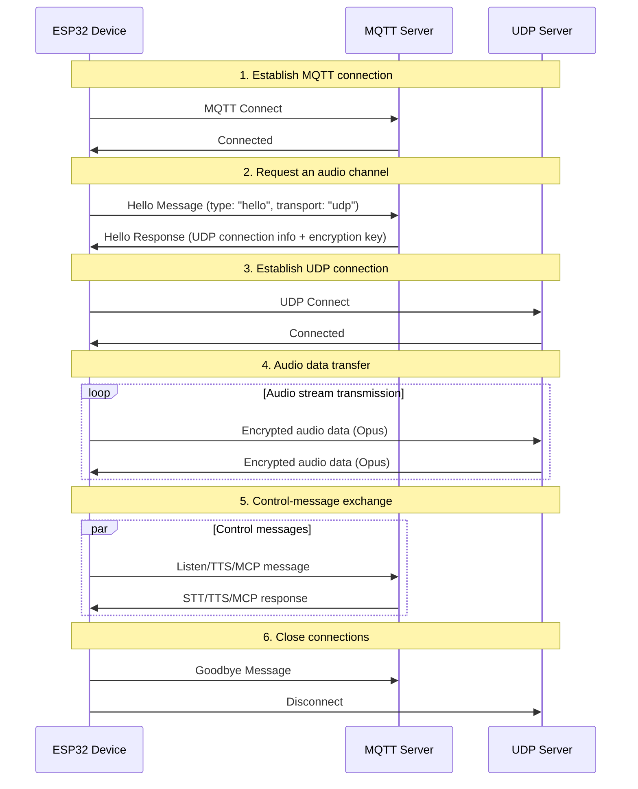
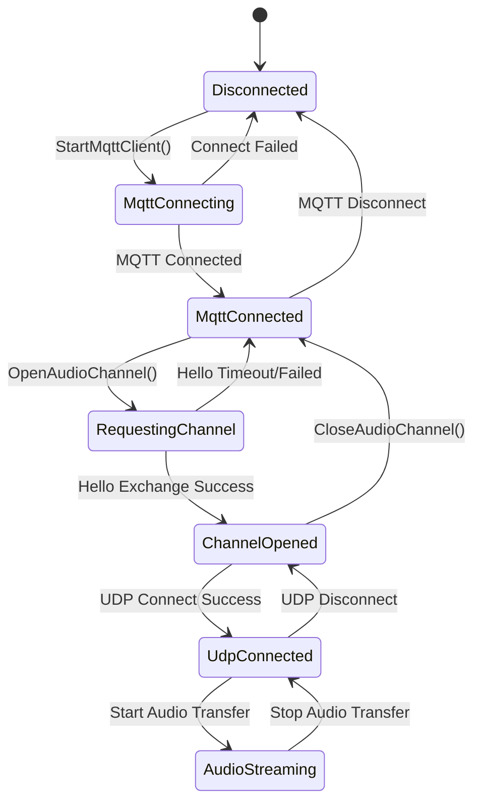

# MQTT + UDP Hybrid Communication Protocol Documentation - mqtt-udp.md

Based on the implementation of the code, this documentation describes how devices and servers interact through MQTT for control‑message transmission and through UDP for audio‑data transmission.

---

## 1. Protocol Overview  

This protocol adopts a hybrid transmission approach:  
- **MQTT**: Used for control messages, state synchronization, and JSON data exchange.  
- **UDP**: Used for real‑time audio data transmission, with encryption support.  

### 1.1 Protocol Features  

- **Dual‑channel design**: Control and data channels are separated to ensure real‑time performance.  
- **Encrypted transmission**: Audio data over UDP is encrypted using AES‑CTR.  
- **Sequence‑number protection**: Prevents packet replay and out‑of‑order delivery.  
- **Automatic reconnection**: If the MQTT connection drops, it is automatically re‑established.

---

## 2. Overall Process Overview  



---

## 3. MQTT Control Channel  

### 3.1 Connection Establishment  

The device connects to the server with the following parameters:  
- **Endpoint**: MQTT server address and port  
- **Client ID**: Unique identifier for the device  
- **Username/Password**: Authentication credentials  
- **Keep Alive**: Heartbeat interval (default 240 seconds)  

### 3.2 Hello Message Exchange  

#### 3.2.1 Device → Server: Hello Message  

```json
{
  "type": "hello",
  "version": 3,
  "transport": "udp",
  "features": {
    "mcp": true
  },
  "audio_params": {
    "format": "opus",
    "sample_rate": 16000,
    "channels": 1,
    "frame_duration": 60
  }
}
```

#### 3.2.2 Server → Device: Hello Response  

```json
{
  "type": "hello",
  "transport": "udp",
  "session_id": "xxx",
  "audio_params": {
    "format": "opus",
    "sample_rate": 24000,
    "channels": 1,
    "frame_duration": 60
  },
  "udp": {
    "server": "192.168.1.100",
    "port": 8888,
    "key": "0123456789ABCDEF0123456789ABCDEF",
    "nonce": "0123456789ABCDEF0123456789ABCDEF"
  }
}
```

**Field explanations:**  
- `udp.server`: UDP server address  
- `udp.port`: UDP server port  
- `udp.key`: AES encryption key (hexadecimal string)  
- `udp.nonce`: AES encryption nonce (hexadecimal string)  

### 3.3 JSON Message Types  

#### 3.3.1 Device → Server  

1. **Listen Message**  
   ```json
   {
     "session_id": "xxx",
     "type": "listen",
     "state": "start",
     "mode": "manual"
   }
   ```

2. **Abort Message**  
   ```json
   {
     "session_id": "xxx",
     "type": "abort",
     "reason": "wake_word_detected"
   }
   ```

3. **MCP Message**  
   ```json
   {
     "session_id": "xxx",
     "type": "mcp",
     "payload": {
       "jsonrpc": "2.0",
       "id": 1,
       "result": {...}
     }
   }
   ```

4. **Goodbye Message**  
   ```json
   {
     "session_id": "xxx",
     "type": "goodbye"
   }
   ```

#### 3.3.2 Server → Device  

Supported message types are identical to those used in the WebSocket protocol, including:  
- **STT**: Speech‑to‑text result  
- **TTS**: Text‑to‑speech control  
- **LLM**: Emotion‑expression control  
- **MCP**: IoT control  
- **System**: System control  
- **Custom**: Custom messages (optional)  

---

## 4. UDP Audio Channel  

### 4.1 Connection Establishment  

After receiving the UDP connection information from the MQTT Hello response, the device:  
1. Parses the server address and port.  
2. Parses the encryption key and nonce.  
3. Initializes the AES‑CTR encryption context.  
4. Establishes the UDP connection.  

### 4.2 Audio Data Format  

#### 4.2.1 Encrypted Audio Packet Structure  

```
|type 1byte|flags 1byte|payload_len 2bytes|ssrc 4bytes|timestamp 4bytes|sequence 4bytes|
|payload payload_len bytes|
```

**Field descriptions:**  
- `type`: Packet type; fixed to `0x01`.  
- `flags`: Flags; currently unused.  
- `payload_len`: Length of the payload (network byte order).  
- `ssrc`: Synchronization source identifier.  
- `timestamp`: Timestamp (network byte order).  
- `sequence`: Sequence number (network byte order).  
- `payload`: Encrypted Opus audio data.  

#### 4.2.2 Encryption Algorithm  

- **Algorithm**: AES‑CTR.  
- **Key**: 128‑bit key provided by the server.  
- **Nonce**: 128‑bit nonce provided by the server.  
- **Counter**: Comprises timestamp and sequence information.  

### 4.3 Sequence‑Number Management  

- **Sender side**: `local_sequence_` increments monotonically.  
- **Receiver side**: `remote_sequence_` checks continuity.  
- **Replay prevention**: Packets with a sequence number lower than expected are discarded.  
- **Fault tolerance**: Minor sequence jumps are tolerated; warnings are logged.  

### 4.4 Error Handling  

1. **Decryption failure**: Log the error and drop the packet.  
2. **Sequence anomaly**: Log a warning but still process the packet.  
3. **Malformed packet**: Log the error and drop the packet.  

---

## 5. State Management  

### 5.1 Connection State  



### 5.2 State Checking  

The device determines whether an audio channel is available via:  

```cpp
bool IsAudioChannelOpened() const {
    return udp_ != nullptr && !error_occurred_ && !IsTimeout();
}
```

---

## 6. Configuration Parameters  

### 6.1 MQTT Configuration  

Parameters read from the device settings:  
- `endpoint`: MQTT server address  
- `client_id`: Client identifier  
- `username`: Username  
- `password`: Password  
- `keepalive`: Heartbeat interval (default 240 seconds)  
- `publish_topic`: Publish topic  

### 6.2 Audio Parameters  

- **Format**: Opus  
- **Sample rate**: 16 kHz (device side) / 24 kHz (server side)  
- **Channels**: 1 (mono)  
- **Frame duration**: 60 ms  

---

## 7. Error Handling & Reconnection  

### 7.1 MQTT Reconnection Mechanism  

- Automatic retry on connection failure.  
- Supports error reporting controls.  
- Triggers cleanup procedures on disconnection.  

### 7.2 UDP Connection Management  

- No automatic retry on failure; reconnection depends on re‑negotiation via MQTT.  
- Provides a method to query connection status.  

### 7.3 Timeout Handling  

The base `Protocol` class offers timeout detection:  
- Default timeout: 120 seconds.  
- Calculated based on the last received time.  
- When a timeout occurs, the channel is marked as unavailable.  

---

## 8. Security Considerations  

### 8.1 Transport Encryption  

- **MQTT**: TLS/SSL encryption is supported (port 8883).  
- **UDP**: Audio data is encrypted with AES‑CTR.  

### 8.2 Authentication  

- **MQTT**: Username/password authentication.  
- **UDP**: Keys are distributed via the MQTT channel.  

### 8.3 Replay‑Attack Prevention  

- Monotonically increasing sequence numbers.  
- Rejection of expired packets.  
- Timestamp validation.  

---

## 9. Performance Optimization  

### 9.1 Concurrency Control  

A mutex protects the UDP connection:  

```cpp
std::lock_guard<std::mutex> lock(channel_mutex_);
```

### 9.2 Memory Management  

- Dynamically create and destroy network objects.  
- Smart pointers manage audio packets.  
- Encryption contexts are released promptly.  

### 9.3 Network Optimization  

- UDP connection reuse.  
- Optimized packet size.  
- Sequence‑number continuity checks.  

---

## 10. Comparison with WebSocket Protocol  

| Feature                | MQTT + UDP                              | WebSocket                |
|------------------------|------------------------------------------|--------------------------|
| Control channel        | MQTT                                     | WebSocket                |
| Audio channel          | UDP (encrypted)                          | WebSocket (binary)       |
| Real‑time performance  | High (UDP)                               | Medium                   |
| Reliability            | Medium                                   | High                     |
| Complexity             | High                                     | Low                      |
| Encryption             | AES‑CTR                                  | TLS                      |
| Firewall friendliness  | Low                                      | High                     |

---

## 11. Deployment Recommendations  

### 11.1 Network Environment  

- Ensure UDP ports are reachable.  
- Configure firewall rules accordingly.  
- Consider NAT traversal techniques.  

### 11.2 Server Configuration  

- Deploy an MQTT broker.  
- Run a UDP server.  
- Manage encryption keys securely.  

### 11.3 Monitoring Metrics  

- Connection success rate.  
- Audio transmission latency.  
- Packet loss rate.  
- Decryption failure rate.  

---

## 12. Summary  

The MQTT + UDP hybrid protocol achieves efficient audio‑visual communication through the following design:  

- **Separation of concerns**: Control and data channels are isolated, each serving its purpose.  
- **Data protection**: AES‑CTR ensures secure audio transmission.  
- **Sequence management**: Prevents replay attacks and handles out‑of‑order packets.  
- **Automatic recovery**: Reconnects automatically after disconnection.  
- **Performance tuning**: UDP provides real‑time audio while optimizations keep overhead low.  

This protocol is suited for voice‑interaction scenarios that demand low latency, though it involves a trade‑off between network complexity and transmission performance.
