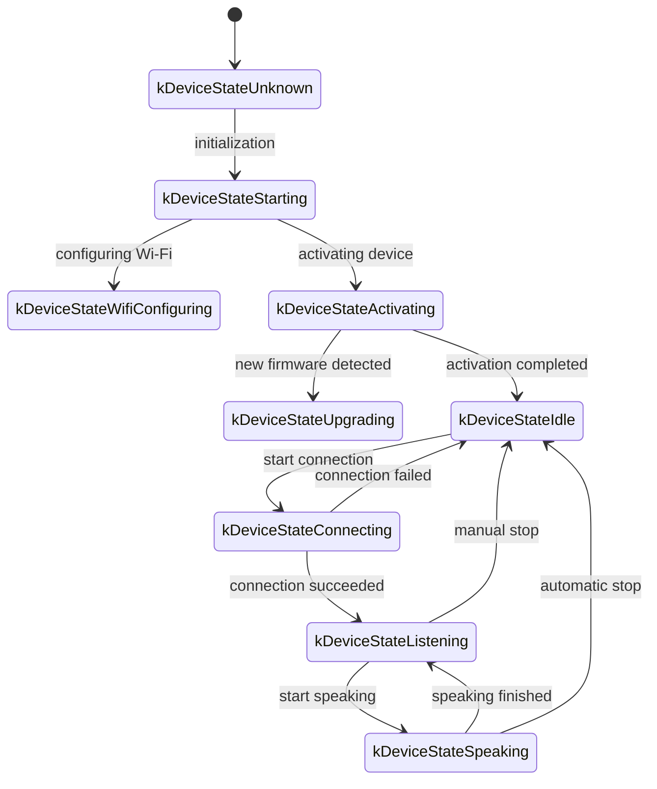
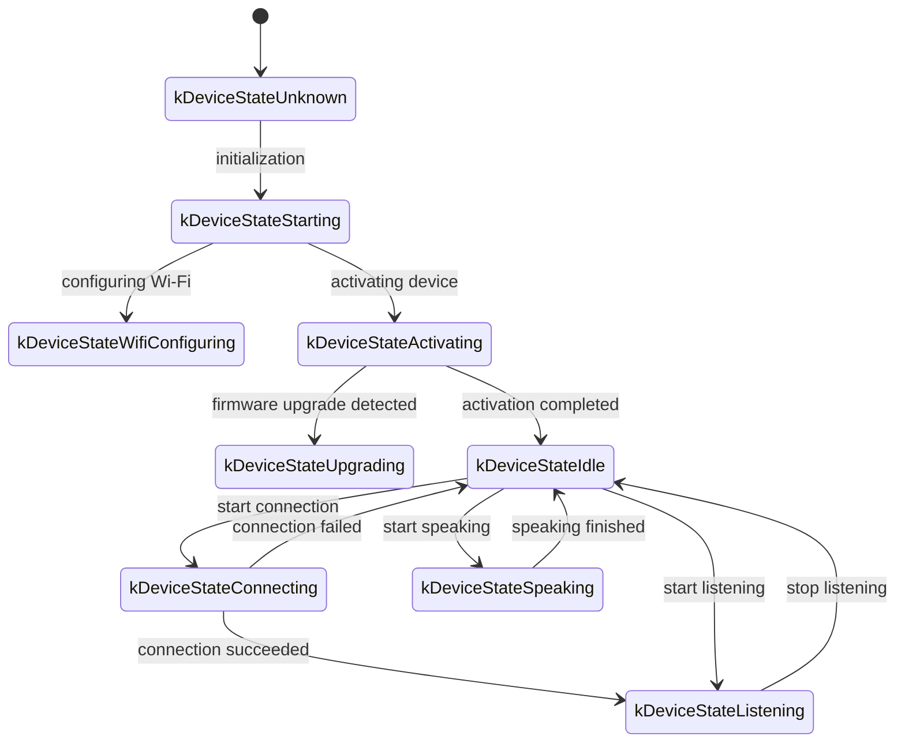

# XiaoZhi WebSocket Communication Protocol - websocket.md

Below is a documentation of the WebSocket communication protocol, organized based on the code implementation, that outlines how devices and the server interact via WebSocket.

This document is inferred solely from the provided code; actual deployments may require additional confirmation or supplementation based on the server‑side implementation.

## 1. Overall Flow Overview  

1. **Device Initialization**  
   - Device powers on, initializes `Application`:  
     - Initializes audio codec, display, LED, etc.  
     - Connects to the network  
     - Creates and initializes a WebSocket protocol instance (`WebsocketProtocol`) that implements the `Protocol` interface  
   - Enters the main loop and waits for events (audio input, audio output, scheduling tasks, etc.).

2. **Establish WebSocket Connection**  
   - When the device needs to start a voice session (e.g., user wake‑up, manual button trigger, etc.), it calls `OpenAudioChannel()`:  
     - Retrieves the WebSocket URL according to configuration  
     - Sets several request headers (`Authorization`, `Protocol-Version`, `Device-Id`, `Client-Id`)  
     - Calls `Connect()` to establish a WebSocket connection with the server  

3. **Device Sends “hello” Message**  
   - After the connection succeeds, the device sends a JSON message, example structure:  
   ```json
   {
     "type": "hello",
     "version": 1,
     "features": {
       "mcp": true
     },
     "transport": "websocket",
     "audio_params": {
       "format": "opus",
       "sample_rate": 16000,
       "channels": 1,
       "frame_duration": 60
     }
   }
   ```  
   - The `features` field is optional and its content is automatically generated based on the device’s compile‑time configuration. For example, `"mcp": true` indicates that the device supports the MCP protocol.  
   - `frame_duration` corresponds to `OPUS_FRAME_DURATION_MS` (e.g., 60 ms).

4. **Server Replies with “hello”**  
   - The device waits for the server to return a JSON message containing `"type": "hello"` and checks that `"transport": "websocket"` matches.  
   - The server may optionally include a `session_id` field; once the device receives it, it records the identifier.  
   - Example:  
   ```json
   {
     "type": "hello",
     "transport": "websocket",
     "session_id": "xxx",
     "audio_params": {
       "format": "opus",
       "sample_rate": 24000,
       "channels": 1,
       "frame_duration": 60
     }
   }
   ```  
   - If the fields match, the device marks the audio channel as successfully opened.  
   - If a timeout (default 10 seconds) occurs without a proper reply, the device treats the connection as failed and triggers a network‑error callback.

5. **Subsequent Message Exchange**  
   - Between device and server, two main data types can be exchanged:  
     1. **Binary audio data** (Opus‑encoded)  
     2. **Text JSON messages** (used to transmit chat states, TTS events, MCP protocol messages, etc.)  

   - In the code, the receive callback is split into:  
     - `OnData(...)`:  
       - When `binary` is `true`, it is treated as an audio frame; the device decodes it as Opus data.  
       - When `binary` is `false`, it is JSON text that must be parsed with cJSON and processed according to the business logic (e.g., chat, TTS, MCP protocol messages).  

   - When the server or network disconnects, the callback `OnDisconnected()` is triggered:  
     - The device calls `on_audio_channel_closed_()` and finally returns to the idle state.

6. **Closing the WebSocket Connection**  
   - When the voice session needs to end, the device calls `CloseAudioChannel()` to actively disconnect and return to the idle state.  
   - Alternatively, if the server initiates the disconnect, the same callback flow is executed.

---

## 2. Common Request Headers  

When establishing the WebSocket connection, the code sets the following request headers:

- `Authorization`: stores the access token, formatted as `"Bearer <token>"`  
- `Protocol-Version`: the protocol version number, which must match the `version` field in the hello payload  
- `Device-Id`: the physical network card MAC address of the device  
- `Client-Id`: a software‑generated UUID (resets if NVS is erased or the firmware is reflashed)

These headers are sent together with the WebSocket handshake and can be validated/used for authentication by the server.

---

## 3. Binary Protocol Versions  

The device supports multiple binary protocol versions, selected via the `version` field in the configuration:

### 3.1 Version 1 (Default)  
Directly sends Opus audio data without extra metadata. WebSocket distinguishes between text and binary frames.

### 3.2 Version 2  
Uses the `BinaryProtocol2` structure:  
```c
struct BinaryProtocol2 {
    uint16_t version;        // protocol version
    uint16_t type;           // message type (0: OPUS, 1: JSON)
    uint32_t reserved;       // reserved field
    uint32_t timestamp;      // timestamp in milliseconds (for server AEC)
    uint32_t payload_size;   // payload size in bytes
    uint8_t payload[];       // payload data
} __attribute__((packed));
```

### 3.3 Version 3  
Uses the `BinaryProtocol3` structure:  
```c
struct BinaryProtocol3 {
    uint8_t type;            // message type
    uint8_t reserved;        // reserved byte
    uint16_t payload_size;   // payload size
    uint8_t payload[];       // payload data
} __attribute__((packed));
```

---

## 4. JSON Message Structures  

WebSocket text frames are transmitted as JSON. The following outlines the common `"type"` values and their semantics. Additional fields may appear depending on the implementation.

### 4.1 Device → Server  

1. **Hello**  
   - Sent by the device after a successful connection to announce its capabilities.  
   - Example:  
   ```json
   {
     "type": "hello",
     "version": 1,
     "features": {
       "mcp": true
     },
     "transport": "websocket",
     "audio_params": {
       "format": "opus",
       "sample_rate": 16000,
       "channels": 1,
       "frame_duration": 60
     }
   }
   ```

2. **Listen**  
   - Indicates that the device is starting or stopping audio recording.  
   - Typical fields:  
     - `"session_id"` – session identifier  
     - `"type": "listen"`  
     - `"state"` – `"start"`, `"stop"`, or `"detect"` (wake‑word detection triggered)  
     - `"mode"` – `"auto"`, `"manual"` or `"realtime"` (recognition mode)  
   - Example for starting listening:  
   ```json
   {
     "session_id": "xxx",
     "type": "listen",
     "state": "start",
     "mode": "manual"
   }
   ```

3. **Abort**  
   - Terminates the current speaking or voice channel.  
   - Example:  
   ```json
   {
     "session_id": "xxx",
     "type": "abort",
     "reason": "wake_word_detected"
   }
   ```  
   - `reason` can be `"wake_word_detected"` or other reasons.

4. **Wake Word Detected**  
   - Sent by the device to inform the server that a wake word has been detected.  
   - Before sending this message, the device may first transmit the wake‑word audio (Opus) so the server can perform speaker verification.  
   - Example:  
   ```json
   {
     "session_id": "xxx",
     "type": "listen",
     "state": "detect",
     "text": "hello xiaoming"
   }
   ```

5. **MCP**  
   - Recommended for IoT control. All capability discovery, tool invocation, etc., are carried in messages with `type: "mcp"`. The payload follows JSON‑RPC 2.0 format (see [MCP Protocol Document](./mcp-protocol.md)).  

   - **Device → Server Example (result)**  
   ```json
   {
     "session_id": "xxx",
     "type": "mcp",
     "payload": {
       "jsonrpc": "2.0",
       "id": 1,
       "result": {
         "content": [
           { "type": "text", "text": "true" }
         ],
         "isError": false
       }
     }
   }
   ```

### 4.2 Server → Device  

1. **Hello**  
   - Server’s reply during the handshake.  
   - Must contain `"type": "hello"` and `"transport": "websocket"`.  
   - May also include `audio_params` to indicate the server‑expected audio configuration or to align with the device’s configuration.  
   - The server may optionally provide a `session_id` that the device records.  

2. **STT**  
   - `{"session_id": "xxx", "type": "stt", "text": "..."}`  
   - Sent by the server to indicate that speech has been recognized (e.g., ASR result).  
   - The device may display the returned text on its screen and proceed to the response phase.

3. **LLM**  
   - `{"session_id": "xxx", "type": "llm", "emotion": "happy", "text": "😀"}`  
   - Server instructs the device to adjust facial expressions / UI elements based on the emotion.

4. **TTS**  
   - `{"session_id": "xxx", "type": "tts", "state": "start"}` – Server signals that TTS audio will be sent; the device enters the “speaking” playback state.  
   - `{"session_id": "xxx", "type": "tts", "state": "stop"}` – Indicates that the current TTS playback has finished.  
   - `{"session_id": "xxx", "type": "tts", "state": "sentence_start", "text": "..."}` – Provides the text fragment that is about to be spoken, allowing the UI to show the current phrase.

5. **MCP**  
   - The server can send MCP‑type messages to issue IoT control commands or return tool‑call results. The payload structure is the same as in the device‑to‑server direction.  

   - **Server → Device Example (tools/call)**  
   ```json
   {
     "session_id": "xxx",
     "type": "mcp",
     "payload": {
       "jsonrpc": "2.0",
       "method": "tools/call",
       "params": {
         "name": "self.light.set_rgb",
         "arguments": { "r": 255, "g": 0, "b": 0 }
       },
       "id": 1
     }
   }
   ```

6. **System**  
   - System control commands, commonly used for remote firmware updates.  
   - Example:  
   ```json
   {
     "session_id": "xxx",
     "type": "system",
     "command": "reboot"
   }
   ```  
   - Supported commands include `"reboot"` (reboot the device).

7. **Custom** (Optional)  
   - When `CONFIG_RECEIVE_CUSTOM_MESSAGE` is enabled, custom messages are supported.  
   - Example:  
   ```json
   {
     "session_id": "xxx",
     "type": "custom",
     "payload": {
       "message": "custom content"
     }
   }
   ```

8. **Binary Audio Frames**  
   - When the server sends binary frames (Opus‑encoded audio), the device decodes and plays them.  
   - If the device is in a “listening” (recording) state, received audio frames are typically ignored or cleared to avoid conflicts.

---

## 5. Audio Encoding  

1. **Device Sends Recorded Audio**  
   - Mic input undergoes echo cancellation, noise suppression, or gain adjustment before being encoded with Opus and packaged into binary frames for transmission to the server.  
   - Depending on the protocol version, the frames may be sent directly as Opus data (Version 1) or wrapped with metadata using BinaryProtocol2/3.

2. **Device Plays Back Received Audio**  
   - Upon receiving a binary frame from the server, the device decodes it as Opus audio and routes it to the audio output.  
   - If the server’s sample rate differs from the device’s native rate, the audio is resampled before playback.

---

## 6. Common State Transitions  

The following describes typical state changes on the device side and their corresponding WebSocket messages:

1. **Idle → Connecting**  
   - Triggered by a user action or wake‑up; the device calls `OpenAudioChannel()` → establishes a WebSocket → sends `"type":"hello"`.

2. **Connecting → Listening**  
   - After a successful connection, if the device invokes `SendStartListening(...)`, it enters the recording state and begins transmitting encoded microphone data.

3. **Listening → Speaking**  
   - Upon receipt of a TTS‑Start message (`{"type":"tts","state":"start"}`), the device stops recording and begins playing back the received audio.

4. **Speaking → Idle**  
   - When the server sends a TTS‑Stop message (`{"type":"tts","state":"stop"}`), audio playback ends. If no further automatic listening is configured, the device returns to Idle; otherwise it may re‑enter Listening.

5. **Listening / Speaking → Idle** (on error or manual abort)  
   - `SendAbortSpeaking(...)` or `CloseAudioChannel()` is called, terminating the session, closing the WebSocket, and returning to Idle.

### State‑Transition Diagrams  

#### Automatic Mode  


#### Manual Mode  


---

## 7. Error Handling  

1. **Connection Failure**  
   - If `Connect(url)` fails or the device times out waiting for the server’s `"hello"` response, the callback `on_network_error_()` is invoked. The device may display an error such as “Unable to connect to server”.

2. **Server Disconnect**  
   - If the WebSocket is abruptly closed, the callback `OnDisconnected()` is triggered:  
     - The device invokes `on_audio_channel_closed_()`  
     - It transitions to Idle or initiates a retry logic.

---

## 8. Other Notes  

1. **Authentication**  
   - The device supplies a token via `Authorization: Bearer <token>`. The server must validate it; an expired or invalid token may cause the handshake or later messages to be rejected.

2. **Session Control**  
   - Some messages contain a `session_id` field to distinguish separate conversations or operations. The server can manage different sessions independently.

3. **Audio Payload**  
   - Opus is used by default, with `sample_rate = 16000` and single‑channel audio. Frame duration is controlled by `OPUS_FRAME_DURATION_MS`, typically 60 ms. For higher‑quality music playback, the server may send audio with a 24 kHz sample rate.

4. **Protocol Version Configuration**  
   - The `version` setting determines which binary protocol (1, 2, or 3) is used. Each version adds different metadata fields as described above.

5. **IoT Control Recommended via MCP**  
   - Device‑to‑server capability discovery, state synchronization, and command issuance are recommended to be implemented through the MCP protocol (`type: "mcp"`). The previous `"iot"` approach has been deprecated.  
   - MCP can operate over WebSocket, MQTT, or other transports; it offers better extensibility and standardization. Detailed usage can be found in [MCP Protocol Document](./mcp-protocol.md) and [MCP IoT Usage Guide](./mcp-usage.md).

6. **Malformed JSON**  
   - If a JSON message lacks a required field (e.g., missing `"type"`), the device logs an error (`ESP_LOGE(TAG, "Missing message type, data: %s", data);`) and does not execute any business logic.

---

## 9. Message Examples  

Below is a simplified end‑to‑end exchange:

1. **Device → Server (Handshake)**  
   ```json
   {
     "type": "hello",
     "version": 1,
     "features": {
       "mcp": true
     },
     "transport": "websocket",
     "audio_params": {
       "format": "opus",
       "sample_rate": 16000,
       "channels": 1,
       "frame_duration": 60
     }
   }
   ```

2. **Server → Device (Handshake Response)**  
   ```json
   {
     "type": "hello",
     "transport": "websocket",
     "session_id": "xxx",
     "audio_params": {
       "format": "opus",
       "sample_rate": 16000
     }
   }
   ```

3. **Device → Server (Start Listening)**  
   ```json
   {
     "session_id": "xxx",
     "type": "listen",
     "state": "start",
     "mode": "auto"
   }
   ```  
   - The device simultaneously begins sending binary Opus frames.

4. **Server → Device (ASR Result)**  
   ```json
   {
     "session_id": "xxx",
     "type": "stt",
     "text": "the user just said something"
   }
   ```

5. **Server → Device (Start TTS)**  
   ```json
   {
     "session_id": "xxx",
     "type": "tts",
     "state": "start"
   }
   ```  
   - Followed by the server sending binary audio frames for playback.

6. **Server → Device (TTS Ends)**  
   ```json
   {
     "session_id": "xxx",
     "type": "tts",
     "state": "stop"
   }
   ```  
   - The device stops playback and, if no further instruction is pending, returns to Idle.

---

## 10. Summary  

This protocol uses WebSocket as a transport layer to convey both JSON‑encoded control messages and binary Opus audio streams. Its core characteristics are:

- **Handshake**: Device sends a `"type":"hello"` message and awaits the server’s reply.  
- **Audio Channel**: Opus‑encoded binary frames are exchanged in both directions, supporting multiple protocol versions.  
- **JSON Messages**: The `"type"` field identifies the message purpose (TTS, STT, MCP, Wake‑Word, System, Custom, etc.).  
- **Extensibility**: Additional fields can be added to JSON payloads or request headers as needed.

Both server and device must agree on the exact semantics of each field, the message flow, and error‑handling behavior to ensure reliable communication. The documentation above serves as a foundational reference for integration, development, and future extensions.